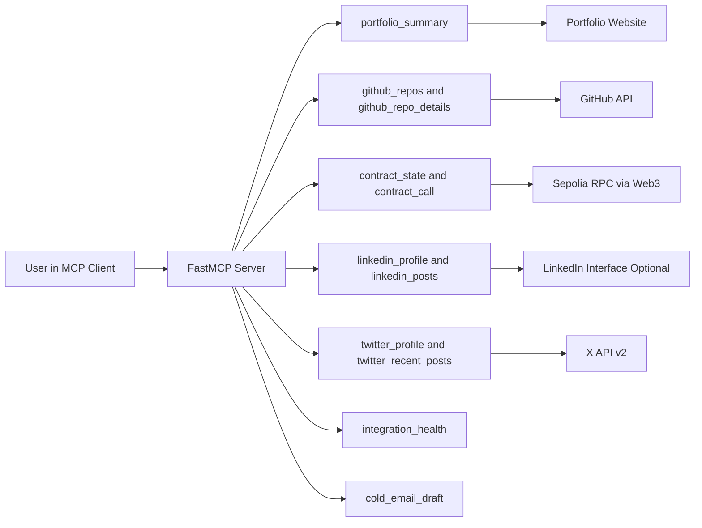
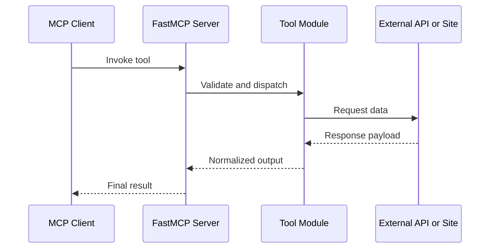
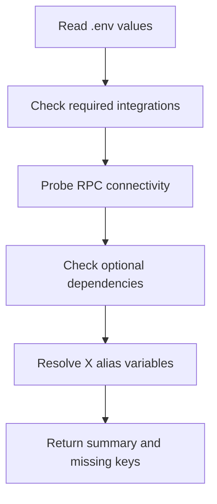

# Aditya Personal MCP Server

Personal MCP Server is a local AI context backend that connects your real engineering footprint to any MCP-compatible assistant. It turns static profile statements into live, queryable data from your portfolio, GitHub, deployed contracts, and social channels.

## Project Snapshot

- Framework: FastMCP (Python)
- Runtime: local stdio server
- Integrations: Portfolio, GitHub, Sepolia/Web3, LinkedIn (optional), X (optional)
- Value: assistants answer with your actual data, not generic assumptions

## Why This Project Exists

The core problem is fragmented identity. Your work is spread across separate systems:

- Portfolio explains your narrative
- GitHub proves implementation depth
- On-chain contracts show real protocol state
- Social channels show technical communication and visibility

Without a context layer, assistants force you to repeat all of this manually. With this server, one tool call gives an assistant what it needs to reason accurately about your projects.

## What The Server Delivers

- Live context retrieval instead of copy-paste prompts
- Stable tool interfaces for repeated use
- Structured error handling for partially configured environments
- A dedicated health endpoint to diagnose setup in seconds
- A reusable cold outreach prompt grounded in your data

## Architecture



The entrypoint stays intentionally thin. Most logic lives in integration-focused modules under tools, which keeps maintenance clean and extension easy.

## Request Lifecycle



## Repository Structure

- server.py: tool and prompt registration
- tools/portfolio.py: website parsing and project extraction
- tools/github.py: repository list and repo detail lookup
- tools/contracts.py: ABI-based state and view-function reads
- tools/linkedin.py: optional LinkedIn profile and posts
- tools/twitter.py: X profile and tweet metrics
- tools/health.py: integration readiness and env diagnostics
- tools/email_draft.py: context assembly for outbound writing
- abis/: ABI files for deployed contract interactions
- .env.example: complete configuration template
- requirements.txt: Python dependencies

## Tool Catalog

| Tool | Purpose | Output |
|---|---|---|
| portfolio_summary | Scrape portfolio headline, about, and project blocks | Dict |
| github_repos | List repositories with metadata | List |
| github_repo_details | Fetch README and repository-level details | Dict |
| contract_state | Read chain and contract diagnostics | Dict |
| contract_call | Execute zero-arg view or pure function | Dict |
| linkedin_profile | Pull profile summary and career fields | Dict |
| linkedin_posts | Pull recent post-level engagement | List |
| twitter_profile | Pull public X profile stats | Dict |
| twitter_recent_posts | Pull recent tweet metrics | List |
| integration_health | Validate env and runtime readiness | Dict |

Prompt:

- cold_email_draft(recipient_role, company): generate a concise outreach draft using live context

## Health System

Health is the first command you should run after every environment change.



Health output gives three practical answers quickly:

- Is core stack usable now?
- Which keys are still missing?
- Is blockchain connectivity actually reachable?

## Environment Configuration

Required for core use:

- PORTFOLIO_URL
- GITHUB_USERNAME
- RPC_URL
- X_BEARER_TOKEN if you want X tools enabled

GitHub optional but recommended:

- GITHUB_PAT

LinkedIn optional:

- LINKEDIN_EMAIL
- LINKEDIN_PASSWORD

X variable support:

- Preferred names: X_CONSUMER_KEY, X_SECRET_KEY
- Backward-compatible names: X_API_KEY, X_API_SECRET
- Optional user context: X_ACCESS_TOKEN, X_ACCESS_SECRET

## Setup

1. Create virtual environment
2. Install dependencies
3. Copy env template
4. Fill keys you want enabled
5. Start server

```bash
pip install -r requirements.txt
copy .env.example .env
python server.py
```

## Claude Desktop Integration (Windows)

Add your MCP server entry in:

%APPDATA%/Claude/claude_desktop_config.json

Example configuration:

```json
{
	"mcpServers": {
		"aditya-personal": {
			"command": "C:/Users/KIIT0001/OneDrive/Desktop/Personal MCP server/.venv/Scripts/python.exe",
			"args": [
				"C:/Users/KIIT0001/OneDrive/Desktop/Personal MCP server/server.py"
			]
		}
	}
}
```

Important:

- Save JSON without BOM
- Fully quit and reopen Claude Desktop
- Start a fresh chat before testing

## Prompt Examples

- Show me my integration health.
- Summarize my portfolio projects.
- List my top GitHub repositories with stars.
- Read contract state for this address using abis/LendingPool.json.
- Draft a cold email to a Smart Contract Engineer at Chainlink.

## Security Notes

- Never commit .env
- Rotate keys if leaked in logs or chats
- Use minimum permissions for PAT and API tokens
- Treat RPC URLs and bearer tokens as sensitive credentials

## Reliability Choices

The project favors predictable behavior over brittle magic:

- Optional integrations do not block startup
- Tool errors return clean messages instead of crashing server
- Contract helper is conservative and safe for common read scenarios
- Health endpoint provides fast diagnosis for missing config

## Known Constraints

- LinkedIn integration can break when upstream behavior changes
- Some X metrics need elevated API access
- Native dependency support can vary by Python version

## Roadmap

- Add per-integration caching with TTL
- Add typed schemas for all tool responses
- Add argumented contract call support with ABI-safe coercion
- Add basic telemetry for latency and failure rates
- Add test suite with mocked provider fixtures

## License

Use this project for personal and educational workflows. Add a formal license file if you plan to distribute widely.

## Final Note

This project is not a static profile page replacement. It is a live context layer for AI-native workflows. Once connected, assistants stop guessing who you are and start querying what you actually build.
