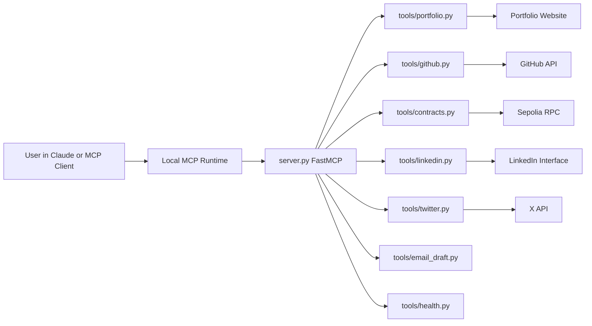
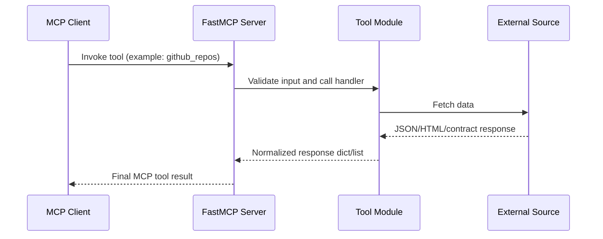
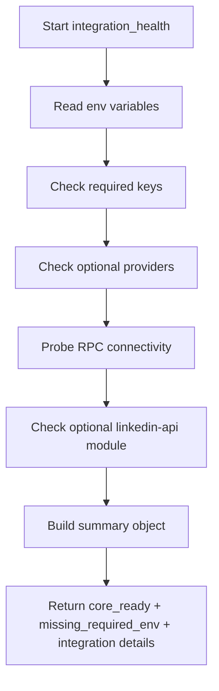

# Aditya Personal MCP Server

Aditya Personal MCP Server is a practical, production-minded personal context layer that connects an AI assistant to the systems that represent your real technical identity. Instead of pasting profile details, portfolio links, repository summaries, or on-chain contract status in every conversation, this server exposes those data sources through a stable set of MCP tools and one reusable prompt. The result is a persistent intelligence interface that gives an AI assistant grounded context about your work, not just generic responses.

At the center of the project is FastMCP with a Python transport over stdio. Around that core, each integration is modularized into a dedicated tool file. Portfolio scraping uses HTTP and HTML parsing, GitHub uses the official API client, contract reads use Web3 against Sepolia RPC, social tooling covers LinkedIn and X, and a prompt generator composes contextual cold outreach from your live data. A dedicated health tool helps you quickly validate what is configured and what still needs action.

## Why This Project Exists

Developers usually have a fragmented online identity. Portfolio sites show polished highlights, GitHub shows implementation depth, deployed contracts reveal protocol reality, and social channels reveal communication and thought leadership. Most assistants only see one of those at a time unless you manually provide context. This project solves that gap by creating a local server that unifies those sources and makes them callable by any MCP-capable client.

This means your assistant can answer questions such as:

- What are the most relevant repositories to mention for a DeFi role?
- Is your Sepolia contract reachable and returning expected state?
- Which project themes appear across your portfolio and GitHub?
- Can a short outbound email be generated from real profile context without fabrication?

## Architecture Overview

The server is intentionally thin: it defines tool signatures, loads environment variables, and dispatches to tool modules. Tool modules hold integration logic and error boundaries. This pattern makes the project easy to maintain and easy to extend with additional capabilities like calendar ingestion, resume parsing, job-tracker sync, or productivity analytics.

## Request Lifecycle

Every tool follows the same outcome model: attempt operation, normalize output, and return predictable error payloads when a source is unavailable or partially configured. This keeps the assistant behavior reliable even when optional integrations are intentionally disabled.

## Project Structure

- `server.py`: FastMCP entrypoint that registers tools and prompts.
- `tools/portfolio.py`: Pulls title, about, and project cards from your portfolio URL.
- `tools/github.py`: Lists repositories and fetches repo-level details including README where available.
- `tools/contracts.py`: Reads on-chain state and calls zero-argument view functions.
- `tools/linkedin.py`: Optional LinkedIn integration with graceful dependency handling.
- `tools/twitter.py`: X profile and recent tweet analytics via API v2 client.
- `tools/email_draft.py`: Builds context block used by cold outreach prompt.
- `tools/health.py`: Integration readiness and environment diagnostics.
- `abis/`: Contract ABI files for protocol-specific calls.
- `.env.example`: Template for all required and optional credentials.
- `requirements.txt`: Python dependencies for local runtime.

## Tooling Coverage

The current API surface is intentionally practical:

- `portfolio_summary()` for public website context.
- `github_repos()` and `github_repo_details(repo_name)` for code footprint.
- `contract_state(address, abi_path)` and `contract_call(address, abi_path, fn_name)` for DeFi observability.
- `linkedin_profile(username)` and `linkedin_posts(username, count)` for professional profile context.
- `twitter_profile(username)` and `twitter_recent_posts(username, count)` for social performance snapshots.
- `integration_health()` for setup verification and runtime readiness.
- `cold_email_draft(recipient_role, company)` prompt for constrained outbound drafting.

## Integration Health Logic

The health subsystem is designed to be the first test after setup and the first checkpoint when debugging. It inspects required environment variables, optional variables, dependency availability, and RPC reachability where applicable.

This gives you quick answers to operational questions:

- Is the server healthy enough for core usage right now?
- Which integration is blocking full readiness?
- Is the blockchain endpoint reachable from local network?

## Setup and Local Run

1. Create a Python virtual environment in project root.
2. Install dependencies from `requirements.txt`.
3. Copy `.env.example` to `.env` and fill only the integrations you want.
4. Start the server with `python server.py` from the venv.
5. Connect through an MCP client such as Claude Desktop.

LinkedIn and X can be left unconfigured. The server will still run and return explicit messages for disabled integrations, while core tools continue to operate.

## Claude Desktop Integration (Windows)

Use `%APPDATA%/Claude/claude_desktop_config.json` and add an MCP server entry that points to your project venv Python executable and `server.py`. One common pitfall is file encoding. The config must be valid JSON and should be saved without a UTF-8 BOM to avoid parse failures in some builds.

After updating config, fully quit Claude Desktop from the tray, relaunch, and open a fresh chat. First prompt should call `integration_health` so you can verify loaded tools and environment status before deeper testing.

## Security and Secret Handling

This project is designed for local-first operation and should not leak credentials into version control.

- Keep all tokens in `.env`, never in source code.
- Never commit `.env` or local runtime artifacts.
- Rotate tokens immediately if accidentally exposed.
- Prefer minimum-scope tokens for GitHub and X.
- Treat contract RPC keys as sensitive operational credentials.

Recommended practice is to run this server in a dedicated environment where only required credentials are present, and optional integrations are intentionally left blank unless needed.

## GitHub PAT Guidance

For GitHub integration, `GITHUB_USERNAME` is required and `GITHUB_PAT` is optional for public repo reads. However, using a PAT improves reliability and rate limits. Fine-grained PAT is preferred over legacy classic tokens. If private repositories are needed later, expand token permissions minimally and only for selected repositories.

## Known Constraints

- Python 3.14 can trigger build issues for native packages used by some unofficial libraries.
- LinkedIn integration is optional and may be brittle due upstream changes.
- X impression metrics may require elevated access and user-context permissions.
- Contract function helper currently supports zero-argument view/pure calls for safety.

None of these constraints block core usage. Portfolio, GitHub, contract reads, health checks, and prompt generation still provide high value in a minimal setup.

## Testing Checklist

Run these prompts in your MCP client after startup:

1. Show me my integration health.
2. Summarize my portfolio website.
3. List my GitHub repositories with stars.
4. Get details for repository `<repo_name>`.
5. Read contract state for `<address>` using `abis/LendingPool.json`.
6. Draft a cold email to a Smart Contract Engineer at Chainlink.

The first prompt validates setup. The next prompts validate each data plane independently. If one integration fails, health output and tool-level error payloads make triage straightforward.

## Roadmap

Possible next upgrades include:

- Add structured caching for portfolio and GitHub responses.
- Add typed schemas to normalize tool outputs for downstream app rendering.
- Extend contract tools to support argumented view calls with safe ABI decoding.
- Add optional persistent observability logs for request latency and error distribution.
- Add a role-aware prompt library for outreach, cover letters, and grant submissions.

## Summary

Aditya Personal MCP Server turns scattered professional signals into a single, queryable AI interface. It is local, extensible, integration-aware, and practical for daily usage. By connecting portfolio, code, on-chain state, and communication channels under one MCP server, you enable assistants to respond with context that is current, verifiable, and specific to your actual work. This is the foundation for a personal AI control plane: one endpoint that reflects what you build, what you ship, how your protocol behaves, and how you present yourself across the ecosystem.
